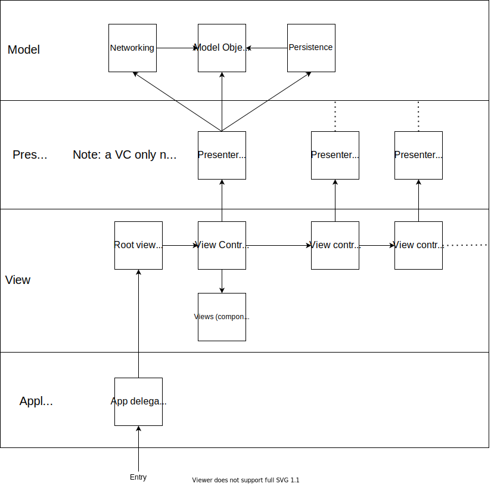

# WotMovie

## Overview
WotMovie is a movie browsing app, where all titles start off hidden. You have to guess what the movie name is based on the description, cast and crew, or you can give up and reveal the title (but it won't count as a correct guess!).

The goal is to name as many movies as you're able to. The secondary goal is to discover new movies to watch just by playing the game.

You can also guess actor/actress names, and TV shows. When guessing an actor/actress, you are given a picture of them, and which movies/TV shows they appear in. Guessing TV shows fucntions the same as guessing movies.

The app is written entirely with Swift, and uses the MVP (Model View Presenter) architecture. See the architecture section below for a rough diagram.

## 3rd party libraries
WotMovie currently does not use any 3rd party libraries, though at some point in the future will likely use AdMob, in order to serve banner ads. Networking is done using Swift's URLSession library, and persistence/caching is implemented using Core Data.

## Architecture
The model layer consists of the model objects used, networking using URLSession, and persistence using Core Data. The networking and persistence modules are only accessible through presenters, and they return model objects of the data which was requested.

The presenters are always accompanied (and are actually owned by) a view controller. Presenters have weak links to their owner VC, in order to prevent retain cycles.

The view layer consists of views and view controllers. Each screen has a root view controller.

